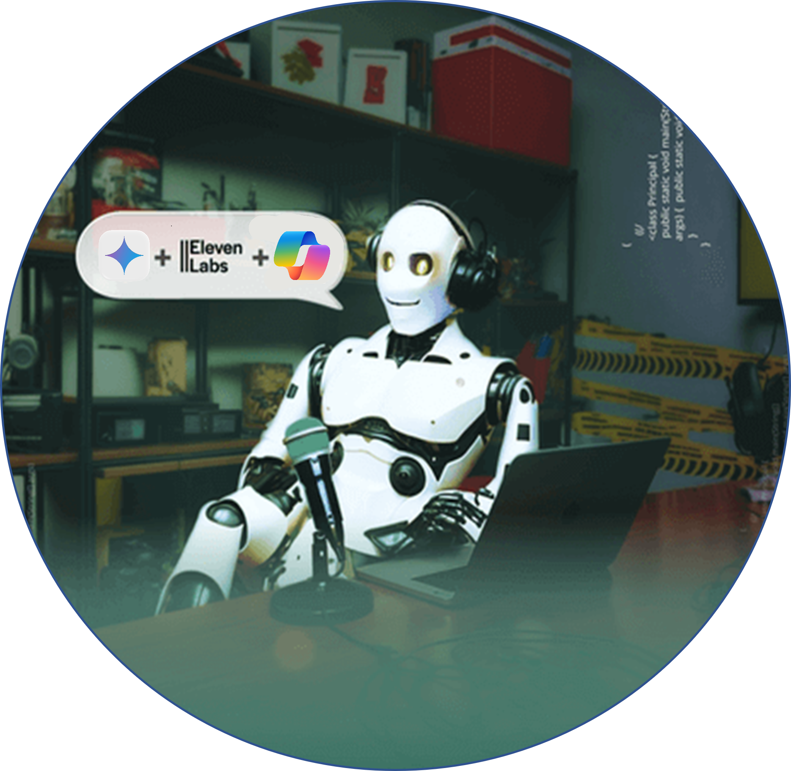

    preview do podcast

    <audio src="output/podcast_editado.MP3" controls title="Podcast editado"></audio>

# Projeto Podcast Gerado por I.A.s

 > ℹ️ **NOTE:** Este é o repositório desenvolvido durante uma live no Youtube em parceria com a [DIO](https://dio.me)

Projeto com o objetivo de gerar um podcast utilizando ferramentas de IA através de prompts mais trabalhado.

Utilizer uma esteira de prompts para gerar cada etapa do processo criativo.

## 💻 Tecnologias utilizadas no projeto

- [Gemini](https://gemini.google.com/) 
- [Copilot](https://copilot.microsoft.com/)
- [ElevenLabs](https://beta.elevenlabs.io/)
- [Capcut](https://www.capcut.com/pt-br/)

## ✨ Como foi feito ?

- Roteiro gerado via gemini
- Áudio gerado pela elevenLabs
- Copilot Para gerar capas
- Capcut para tratar aúdio e adicionar sons de fundo

## 📚 Materiais

- [Notion Conteúdo](https://www.notion.so/PAS-Podcast-AI-Studio-13e2fafb6d0580f8bd95c91cec90ba73)
- [Editor de aúdio](https://www.capcut.com/editor?from_page=landing_page&__action_from=picture_V%C3%ADdeos%20profissionais%20em%20minutos,%20n%C3%A3o%20em%20horas.)

## 🛠️ Instruções de execução

Utilize os prompts dentro do link do `Notion` fornecido na parte de `Materiais` para criar um podcast de maneira automatizada, para isso siga o passo a passo abaixo.

- 🤖 1. Use os prompts de roteiro no `gemini`
- 🤖 2. Use os prompts de roteiro gerados pelo chatgpt no  `ElevenLabs`
- 🤖 3. Use os prompts de artes no `copilot`

## 👨‍💻 Beginner

    
    
&nbsp&nbsp&nbspAlan Sumiya 
    &nbsp&nbsp&nbsp
    <a href="https://github.com/alansumiya">
    GitHub</a>&nbsp;|&nbsp;
    <a href="https://www.linkedin.com/in/alan-sumiya/">LinkedIn</a>
&nbsp;|&nbsp;
    <a href="https://www.instagram.com/alansumiya/">
    Instagram</a>
&nbsp;|&nbsp;

  

---

⌨️ por [Alan Sumiya](https://github.com/alansumiya)
